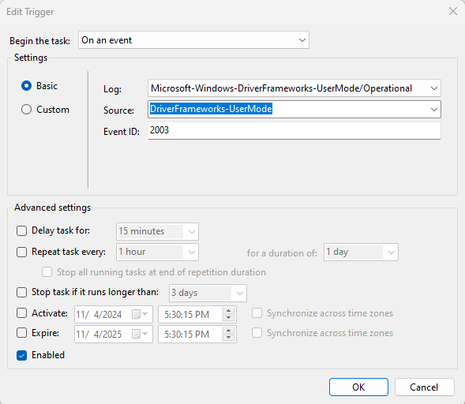

# automatic_volume_transfer

## Description

Automatic Volume Transfer is designed to automatically detect volumes upon instantiation on a Windows system, detect one or more directories within this detected volume, and transfer files from these directories to existing locations. 

This project is designed for the transfer of `.wav` files. Please feel free to manipulate the per extension logic within `automatic_volume_transfer.py`.
This project is also designed for files to have timestamps. A warning will be logged if filenames are not valid timestamps within 30 days of transfer (for recency). Feel free to remove or change this logic as desired.

Please also note that this is designed for *transferring* files, meaning the originals will be deleted. Integrity checks are performed, but please change the logic if deleting the originals is not desired.

For automation, this process is designed to be attached to a task scheduler program (e.g. `Task Scheduler` on Windows). The process for automation via Task Scheduler on Windows is documented within the `Installation` section.

## Getting Starting

### Prerequisites

1. Python 3.11+ is installed on your machine. 
*Previous Python versions may work, but have not been tested*
```bash
python --version  # Windows
python3 --version  # Linux
```

2. Poetry
- Poetry is required for managing dependencies and running the script.
**Installation:**
Please refer to the official Poetry website for installation. Listed below is a past command that may work for reference.
```bash
curl -sSL https://install.python-poetry.org | python3 -
```
**Verify Installation**
```bash
poetry --version
```

### Installation

1. Clone the Repository
```bash
git clone https://github.com/SBroaddus220/automatic_volume_transfer
cd automatic_volume_transfer/
```

2. Install Project Dependencies
Run the following command to install dependencies via Poetry:
```bash
poetry install
```

3. Activate the Poetry Shell (for manual usage)
```bash
poetry shell
```

4. **FFMPEG (optional):** If transferring `.wav` files, the script will automatically convert them to `.flac` files (lossless compression). 
FFMPEG is required to be on the system's PATH.
- [Download FFmpeg](https://ffmpeg.org/download.html) and follow the installation instructions for your operating system.
- After installation, add FFmpeg to your system's PATH if not done so already by a installer.
- **Windows:**
    1. Copy the path to the FFmpeg `bin` folder (e.g., `C:\ffmpeg\bin`).
    2. Open **System Properties > Environment Variables**
    3. Find the **Path** variable under **System Variables** and click **Edit**
    4. Add the FFmpeg `bin` path and click **OK** to save.
- **Linux/MacOS:**
    - Update your `.bashrc` or `.zshrc` file to include FFmpeg in the PATH:
    ```bash
    export PATH="/path/to/ffmpeg/bin:$PATH"
    ```
    - Apply the change by running:
    ```bash
    source ~/.bashrc  # or source ~/.zshrc
    ```
- Verify the installation by running:
```bash
ffmpeg -version
```

5. Prepare configuration and environment
Edit `VOLUMES` in `config.py` to specify desired source and destination directories to search for upon running the script.
Make sure to read the notes above the variable before editing.

## Running the Script
To execute the Python script manually:
```bash
# NOTE: Ensure Poetry shell (virtual environment) is activated
python `automatic_volume_transfer.py`

# If Poetry shell is not activated, the following command will work. Ensure you are in the project directory.
poetry run python automatic_volume_transfer.py 
```

### Running via `.bat` File
The project includes a `.bat` file for running the script for easy automation within a Windows system.
1. Ensure the `.bat` file is located in the correct directory with necessary permissions.
2. To execute the `.bat` file:
```bash
cd autoamtic_volume_transfer/
.\automatic_volume_transfer.bat
```

### Setting up Task Scheduler (Windows)
1. Open **Task Scheduler**
2. Create a new basic task.
3. Set the trigger:
For instantiation of a newly detected volume on Windows, I've found the following trigger works.

NOTE: This event is not solely for new external volumes (e.g. flash drives). 
In testing, it's occurred upon instantiation of an incoming RDP connection.
The script won't do anything if the source volumes aren't detected in any of the existing volumes, so there's no harm in letting it run but please do consider this.



4. Set the action to run the script. In Windows, the `.bat` file can be conveniently run as the sole executable file. No arguments needed.
*Example in Task Scheduler:*
Action: Start a program
Program/script: `C:\Path\To\automatic_volume_transfer.bat`
Add arguments (optional): 

5. Configure additional settings as needed.

## Authors and Acknowledgement
Steven Broaddus (https://stevenbroaddus.com/#contact)

## Contributing
Contributions are welcome! Feel free to also open issues for major changes.

1. Fork the Project
2. Create your new Branch (`git checkout -b feature/YourFeature`)
3. Commit your changes (`git commit -m 'Add some feature'`)
4. Push to the Branch (`git push origin feature/YourFeature`)
5. Open a pull request

